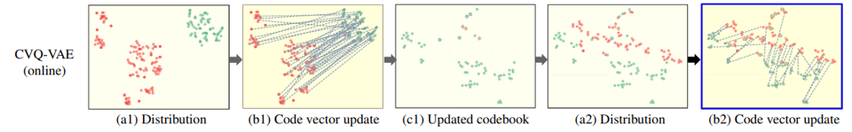
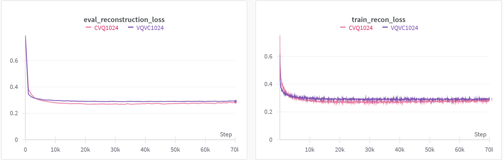

# Influence of Codebook Perplexity in One-Shot Voice Conversion Based on Vector Quantization Method

---

### **Overview**
This project investigates the impact of codebook perplexity on one-shot voice conversion using Vector Quantization (VQ). By integrating the CVQ-VAE (Clustered Vector Quantization Variational Autoencoder) update mechanism into the VQVC (Vector Quantization Voice Conversion) model, we explore its effects on:
- Codebook utility (perplexity),
- Training performance (reconstruction accuracy),
- Test performance (voice conversion similarity).

---

### **Motivation**
- **Voice Conversion Task**:
  - Transforms the source speaker’s voice into a target speaker’s voice while preserving the original content.
  - In vector quantization-based voice conversion (VQVC), vector quantization (VQ) is used to discretize speech features, effectively capturing the content of the source speech.
- **Challenges**:
  - **Codebook Collapse**: When codebook perplexity is low, the codebook’s ability to represent content is compromised. This hinders the separation of content and speaker information, which is critical for successful voice conversion.
  - To address this, enhancing perplexity improves codebook utility, reducing **content leakage** and enabling better representation of speech content.
  - Higher codebook utility leads to reduced content leakage, ultimately improving the overall performance of voice conversion.

---

### **Proposed Method**
1. **CVQ-VAE Integration**:
   - The VQ codebook update rule in VQVC is replaced with the CVQ-VAE update mechanism, which averages sampled vectors from the activated codebook to enhance perplexity.
2. **Evaluation Metrics**:
   - **Codebook Utility**: Measured via perplexity.
   - **Training Performance**: Evaluated through reconstruction accuracy.
   - **Test Performance**: Assessed by similarity between the source and converted voices.

| **CVQ-VAE Codebook Update** |
|------------------------------|
| 

 |

---

### **Key Results**
1. **Codebook Utility**:
   - CVQ significantly improves codebook perplexity, enhancing utilization of the VQ codebook.
   
 | **Perplexity Comparisons** |
 |----------------------------|
 | 

 |

2. **Training Performance**:
   - Reconstruction performance increases with the integration of CVQ-VAE.

 | **Reconstruction Comparisons** |
 |----------------------------|
 | 

 |

3. **Test Performance**:
   - Conversion performance shows no improvement and sometimes declines, indicating a trade-off between reconstruction accuracy and conversion effectiveness.

 | **Similarity Scores** |
 |------------------------|
 | 

 |

4. **Result Summary**:
   - Enhanced perplexity leads to better reconstruction performance but does not necessarily improve voice conversion accuracy. This is consistent with findings in vision tasks, where higher perplexity benefits reconstruction but may disrupt speaker-content separation.

 | **Performance Summary** |
 |--------------------------|
 | 

 |

---

### **Conclusion**
- Integrating CVQ-VAE improves codebook utilization and reconstruction performance.
- Enhanced perplexity interrupts the regularization role of VQ, hindering speaker-content separation and affecting conversion performance.
- The study highlights the trade-off between reconstruction quality and conversion accuracy, providing insights for future research.
  
---
### **References**
1. Da-Yi Wu and Hung-Yi Lee, "One-shot voice conversion by vector quantization," IEEE ICASSP, 2020.
2. C. Zheng and A. Vedaldi, "Online clustered codebook," IEEE ICCV, 2023.
3. H. Wu and M. Flierl, "Vector Quantization-Based Regularization for Autoencoders," AAAI, 2020.
